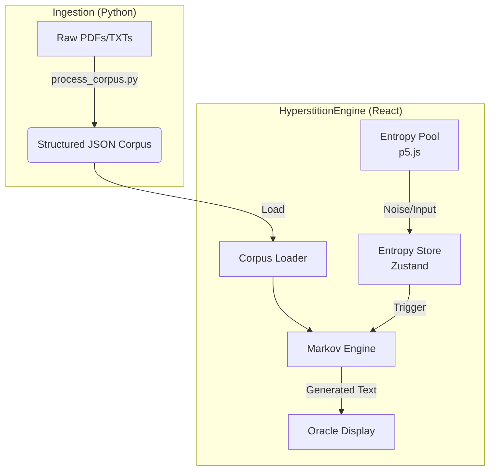

# HyperstitionEngine

**HyperstitionEngine** is a client-side Single Page Application (SPA) designed to generate mystical, oracle-style text and poetry using non-deterministic entropy and classic NLP techniques (Markov chains + Constraint Grammars).

> **Philosophy**: We strictly avoid Large Language Models (LLMs) for the generation phase to preserve "divine randomness" and the chaotic nature of the cut-up technique.

## Features
- **Client-Side Generation**: All logic runs in the browser using React.
- **Entropy Pool**: Uses user interaction (mouse movements, etc.) and system noise to seed the random number generators.
- **Custom Corpus**: Ingests PDFs and text files to create "Spirits" (Markov models) based on specific authors or themes.
- **Visuals**: Integrated `p5.js` for visualizing the entropy and generation process.

## Architecture



## Quick Start

For detailed setup and usage instructions, please see [INSTRUCTIONS.md](./INSTRUCTIONS.md).

### Prerequisites
- Node.js (v18+)
- Python (3.9+) for corpus ingestion

### Installation
1.  Clone the repository.
2.  Install frontend dependencies:
    ```bash
    npm install
    ```
3.  Install ingestor dependencies:
    ```bash
    pip install -r ingestor/requirements.txt
    ```

### Usage
1.  Process your corpus (see Instructions).
2.  Run the dev server:
    ```bash
    npm run dev
    ```

## License
[MIT](LICENSE)
