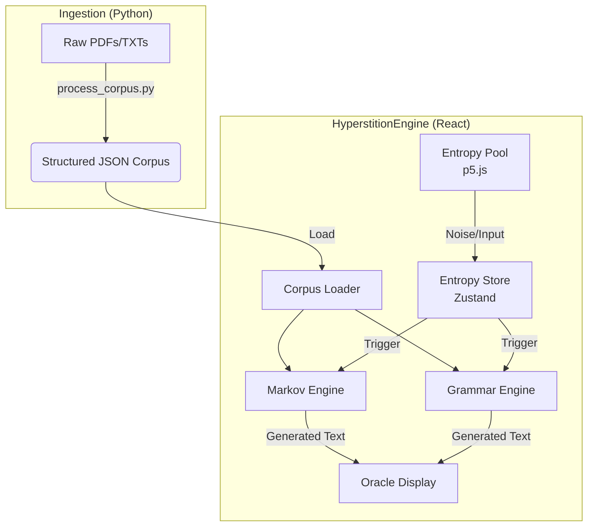

# HyperstitionEngine (v0.9.0 BETA)


A cyber-occult interface for generating "hyperstitions" (fictional ideas that make themselves real) using a combination of Markov chains and grammar-based generation, fueled by user-generated entropy.

## Features
- **Entropy Pool**: Interactive particle system (Smoke/Warp physics) to seed randomness.
- **Dual Engines**:
  - **Markov Chain**: Probabilistic text generation based on a corpus of "Spirits" (Aspects).
  - **Grammar Sigil**: Template-based generation for structured prophecies.
- **Aspects (Spirits)**: Toggleable source texts (e.g., Nick Land, Bible, CCru).
- **Cyber-Occult UI**: "OG Amber" monochrome aesthetic with grain/scanline effects.
- **Batch Generation**: Generate 50 outputs at once for quality testing.

## Architecture


> **Philosophy**: We strictly avoid Large Language Models (LLMs) for the generation phase to preserve "divine randomness" and the chaotic nature of the cut-up technique.

## Quick Start

For detailed setup and usage instructions, please see [INSTRUCTIONS.md](./INSTRUCTIONS.md).

### Prerequisites
- Node.js (v18+)
- Python (3.9+) for corpus ingestion

### Installation
1.  Clone the repository.
2.  Install frontend dependencies:
    ```bash
    npm install
    ```
3.  Install ingestor dependencies:
    ```bash
    pip install -r ingestor/requirements.txt
    ```

### Usage
1.  Process your corpus (see Instructions).
2.  Run the dev server:
    ```bash
    npm run dev
    ```

## License
[MIT](LICENSE)
